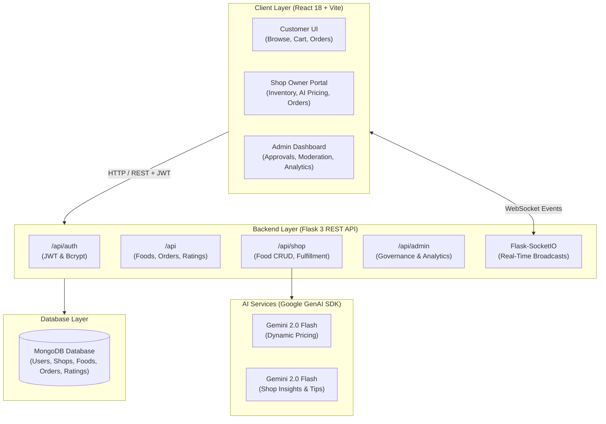

# 🌿 Surplify — Surplus Food Management & Marketplace

<div align="center">

[](https://python.org)
[](https://flask.palletsprojects.com/)
[](https://reactjs.org/)
[](https://vitejs.dev/)
[](https://tailwindcss.com/)
[](https://www.mongodb.com/)
[](https://socket.io/)
[](https://ai.google.dev/)
[](LICENSE)

<p align="center">
  <strong>Save Food. Save Money. Save the Planet. 🌍</strong>
</p>
<p align="center">
  An AI-powered surplus food marketplace connecting restaurants, bakeries, and grocery stores with conscious consumers to combat food waste, offer discounted meals, and maximize revenue recovery.
</p>

</div>

---

## 📑 Table of Contents

- [Overview & Value Proposition](#-overview--value-proposition)
- [Key Features](#-key-features)
  - [🛍️ Customer Experience](#-customer-experience)
  - [🏪 Shop Owner Portal](#-shop-owner-portal)
  - [🤖 Gemini AI Intelligence](#-gemini-ai-intelligence)
  - [🛡️ Admin Governance](#-admin-governance)
  - [⚡ Real-Time Synchronization](#-real-time-synchronization)
- [System Architecture](#-system-architecture)
- [Tech Stack](#-tech-stack)
- [Project Directory Structure](#-project-directory-structure)
- [Getting Started & Quickstart](#-getting-started--quickstart)
  - [Prerequisites](#prerequisites)
  - [1. Backend Setup (Flask + MongoDB)](#1-backend-setup-flask--mongodb)
  - [2. Frontend Setup (React + Vite)](#2-frontend-setup-react--vite)
- [Environment Configuration](#-environment-configuration)
- [Roles & Default Credentials](#-roles--default-credentials)
- [API Reference](#-api-reference)
  - [Authentication Routes](#1-authentication-routes-apiauth)
  - [Customer Routes](#2-customer-routes-api)
  - [Shop Owner Routes](#3-shop-owner-routes-apishop)
  - [Admin Routes](#4-admin-routes-apiadmin)
- [Data Models (MongoDB Collections)](#-data-models-mongodb-collections)
- [Future Roadmap](#-future-roadmap)
- [License](#-license)

---

## 🌟 Overview & Value Proposition

Every year, millions of tons of edible, high-quality food are discarded by restaurants, bakeries, and supermarkets due to strict shelf-life standards and unpredictable daily demand. **Surplify** bridges this gap by creating an accessible, real-time marketplace:

1. **For Customers**: Access freshly prepared, discounted meals and groceries while actively contributing to sustainability.
2. **For Businesses**: Turn potential waste into profit, attract new neighborhood customers, and optimize pricing dynamically using Gemini AI.
3. **For the Planet**: Minimize carbon footprints and landfill waste associated with decomposing surplus food.

---

## ✨ Key Features

### 🛍️ Customer Experience
- **Live Surplus Food Catalog**: Browse active food items with original vs. discounted pricing, available quantities, and pickup time windows.
- **Smart Filtering & Search**: Instant real-time search by food title/description and location filtering by city.
- **Cart & Checkout**: Multi-item cart with live stock validation and order placement.
- **Order Tracking & Lifecycle**: Track order statuses (`pending` → `confirmed` → `ready` → `completed` / `cancelled`).
- **Instant Order Cancellation**: Cancel pending orders with automatic stock replenishment.
- **Shop Ratings & Reviews**: Leave star ratings and feedback after completing an order to foster marketplace trust.

### 🏪 Shop Owner Portal
- **Seamless Shop Onboarding**: Register a shop profile with address, city, and optional map coordinates; submitted for admin verification.
- **Food Inventory Management**: Add, update, toggle availability (`isActive`), and delete surplus items with image URLs, categories, and pickup schedules.
- **Order Fulfillment Pipeline**: Real-time incoming order dashboard with single-click status updates (`pending`, `confirmed`, `ready`, `completed`, `cancelled`).
- **Revenue & Sales Analytics**: Built-in charts and metrics tracking completed orders, total revenue, items sold, remaining stock, and customer ratings.

### 🤖 Gemini AI Intelligence
- **AI Dynamic Price Recommendation**:
  - Leverages Google's `gemini-2.0-flash` model to analyze current item details, stock quantity, urgency/expiry, and category demand metrics.
  - Generates recommended discounted pricing, discount percentages, demand classification (`low`, `medium`, `high`), and clear reasoning to sell surplus before expiry.
  - Built-in heuristic fallback engine ensuring price recommendations work seamlessly even if an API key is not configured.
- **AI Business Insights & Smart Tips**:
  - Aggregates shop performance metrics (total orders, completion rate, revenue, top-selling items, and slow-moving items).
  - Uses Gemini AI to provide executive sales summaries, smart operational tips, and growth observations to minimize food waste and optimize profit margins.

### 🛡️ Admin Governance
- **Shop Approval Workflow**: Review and approve or reject newly registered shops before they can list surplus food.
- **User & Shop Moderation**: Instant block/unblock controls for users and shops with automated cascaded inventory state handling.
- **Platform-Wide Audit & Analytics**: Global analytics tracking total registered users, active shops, food items listed, total orders, platform revenue, total food saved (units sold), and top-performing shops.
- **Order Monitoring**: Unified view of all transactions across all shops on the platform.

### ⚡ Real-Time Synchronization
- **Flask-SocketIO Server**: Real-time broadcasts for inventory changes (`food_update`), new orders placed (`new_order`), order status updates (`order_update`), and admin dashboard notifications (`dashboard_update`).

---

## 🏗 System Architecture



---

## 🛠 Tech Stack

| Layer | Technologies |
|---|---|
| **Frontend** | React 18, Vite 5, React Router v6, Tailwind CSS 3, Recharts, Axios, React Hot Toast, React Icons, Socket.IO Client |
| **Backend** | Python 3.9+, Flask 3.0, Flask-JWT-Extended, Flask-SocketIO, Flask-CORS, PyMongo, Bcrypt, python-dotenv |
| **AI / Machine Learning** | Google Gemini 2.0 Flash (`google-genai` SDK) with heuristic fallback engine |
| **Database** | MongoDB (MongoDB Atlas or local instance) |
| **Authentication** | JSON Web Tokens (JWT) with custom role-based access control (`user`, `shopowner`, `admin`) |

---

## 📁 Project Directory Structure

```
Surplify/
├── backend/
│   ├── routes/
│   │   ├── __init__.py
│   │   ├── auth_routes.py      # User registration, login, profile (/api/auth)
│   │   ├── user_routes.py      # Food browsing, order placement, ratings (/api)
│   │   ├── shop_routes.py      # Shop management, food items, AI tools (/api/shop)
│   │   └── admin_routes.py     # Approvals, user/shop moderation, platform stats (/api/admin)
│   ├── services/
│   │   ├── __init__.py
│   │   ├── ai_pricing.py       # Gemini AI dynamic price recommendation engine
│   │   └── ai_insights.py      # Gemini AI shop performance analysis and smart tips
│   ├── utils/
│   │   ├── __init__.py
│   │   ├── decorators.py       # Role-based JWT authorization decorator
│   │   └── helpers.py          # Document serialization, response envelopes, validation
│   ├── app.py                  # Flask app factory, blueprint registration & socketio init
│   ├── config.py               # Environment configuration loader
│   ├── run.py                  # Server entrypoint with SocketIO runner
│   ├── seed_admin.py           # Admin account seeding script
│   ├── requirements.txt        # Python backend dependencies
│   └── .env                    # Backend environment variables (gitignored)
│
├── frontend/
│   ├── src/
│   │   ├── components/
│   │   │   ├── ai/             # AI Pricing Card, Smart Tips, Observations, Sales Summary
│   │   │   ├── common/         # FoodCard, StatCard, StatusBadge, LoadingSpinner, ProtectedRoute
│   │   │   └── layout/         # Navbar, Footer, DashboardLayout, DashboardSidebar
│   │   ├── context/
│   │   │   ├── AuthContext.jsx # Global user authentication state and JWT storage
│   │   │   └── CartContext.jsx # Global cart state with persistence and calculations
│   │   ├── pages/
│   │   │   ├── admin/          # AdminDashboard, ShopManagement, UserManagement, OrderOverview
│   │   │   ├── public/         # Home, BrowseFood, Login, Register
│   │   │   ├── shop/           # RegisterShop, ManageFood, ShopOrders, ShopAnalytics, AIInsights
│   │   │   └── user/           # UserDashboard, Cart, MyOrders
│   │   ├── services/
│   │   │   └── api.js          # Centralized Axios instance with JWT interceptors
│   │   ├── App.jsx             # React Router routing configuration with role guards
│   │   ├── main.jsx            # React root mount and toast providers
│   │   └── index.css           # Tailwind CSS styles and custom utilities
│   ├── package.json            # Node.js dependencies and scripts
│   ├── vite.config.js          # Vite configuration
│   ├── tailwind.config.js      # Tailwind CSS theme configuration
│   └── .env                    # Frontend environment variables (gitignored)
│
├── PROJECT_DOCUMENTATION.md    # Comprehensive technical reference manual
├── SETUP.md                    # Detailed step-by-step environment setup guide
└── README.md                   # Project overview and quickstart (this file)
```

---

## 🚀 Getting Started & Quickstart

### Prerequisites
- **Python**: 3.9 or higher
- **Node.js**: 18.x or higher (with npm)
- **MongoDB**: Active MongoDB Atlas connection URI or local MongoDB instance (`mongodb://localhost:27017`)
- **Google Gemini API Key** *(Optional, for live AI pricing & insights)*: [Get a Gemini API Key](https://aistudio.google.com/)

---

### 1. Backend Setup (Flask + MongoDB)

```bash
# Navigate to the backend directory
cd backend

# Create a virtual environment
python -m venv .venv

# Activate the virtual environment
# Windows (PowerShell):
.venv\Scripts\Activate.ps1
# Windows (cmd):
.venv\Scripts\activate.bat
# macOS / Linux:
source .venv/bin/activate

# Install dependencies
pip install -r requirements.txt
```

Create a `.env` file in the `backend/` directory:

```env
MONGO_URI=mongodb://localhost:27017/surplify
JWT_SECRET_KEY=your-super-secret-jwt-key-here
GEMINI_API_KEY=your-optional-gemini-api-key
```

Seed the default administrator account:

```bash
python seed_admin.py
```

Run the backend server:

```bash
python run.py
# Server starts at http://localhost:5000 (with Socket.IO enabled)
```

---

### 2. Frontend Setup (React + Vite)

Open a new terminal window:

```bash
# Navigate to the frontend directory
cd frontend

# Install dependencies
npm install
```

Create a `.env` file in the `frontend/` directory:

```env
VITE_API_URL=http://localhost:5000/api
```

Start the Vite development server:

```bash
npm run dev
# App opens at http://localhost:3000 (or http://localhost:5173 depending on port availability)
```

---

## ⚙️ Environment Configuration

### Backend (`backend/.env`)
| Variable | Required | Default | Description |
|---|---|---|---|
| `MONGO_URI` | **Yes** | `mongodb://localhost:27017/surplify` | Connection string for MongoDB database |
| `JWT_SECRET_KEY` | **Yes** | `change-this-in-production` | Secret key used to sign and verify JWT tokens |
| `GEMINI_API_KEY` | Optional | `None` | Google Gemini API key for dynamic pricing and AI analytics |

### Frontend (`frontend/.env`)
| Variable | Required | Default | Description |
|---|---|---|---|
| `VITE_API_URL` | **Yes** | `http://localhost:5000/api` | Base REST API endpoint for the backend server |

---

## 👥 Roles & Default Credentials

| Role | Access Level | Setup / Acquisition |
|---|---|---|
| **Admin** | Full platform governance, shop verification, user/shop moderation, system metrics | Created via `python seed_admin.py`<br/>**Email:** `admin@surplify.com`<br/>**Password:** `admin123` |
| **Shop Owner** | Shop profile, food item listing & stock, order fulfillment, AI insights | Register on `/register` as **Shop Owner**, submit shop details, and await Admin approval |
| **Customer** | Browse food, cart, place orders, order history, cancel orders, review shops | Self-register on `/register` as **Customer** |

---

## 📡 API Reference

All REST endpoints return a unified JSON response envelope:
```json
{
  "success": true,
  "message": "Operation completed successfully",
  "data": { ... }
}
```

### 1. Authentication Routes (`/api/auth`)
| Method | Endpoint | Auth | Description |
|---|---|---|---|
| `POST` | `/api/auth/register` | Public | Register a new user (`user` or `shopowner`) |
| `POST` | `/api/auth/login` | Public | Authenticate user and receive JWT access token |
| `GET` | `/api/auth/me` | JWT | Fetch authenticated user's profile |

### 2. Customer Routes (`/api`)
| Method | Endpoint | Auth | Description |
|---|---|---|---|
| `GET` | `/api/foods` | Public | Browse available surplus foods (supports `?city=`, `?search=`, `?page=`, `?limit=`) |
| `GET` | `/api/foods/:id` | Public | Fetch detailed information for a single food item |
| `POST` | `/api/orders` | Customer | Place a new order with cart items |
| `GET` | `/api/my-orders` | Customer | Retrieve the customer's order history |
| `PUT` | `/api/orders/:id/cancel` | Customer | Cancel a pending order (restores item inventory) |
| `POST` | `/api/shops/:id/rate` | Customer | Submit a rating and review for a shop after order completion |

### 3. Shop Owner Routes (`/api/shop`)
| Method | Endpoint | Auth | Description |
|---|---|---|---|
| `POST` | `/api/shop/register` | Shop Owner | Register a new shop profile |
| `GET` | `/api/shop/my-shop` | Shop Owner | Fetch current owner's shop details and approval status |
| `POST` | `/api/shop/food/add` | Approved Shop | List a new surplus food item |
| `PUT` | `/api/shop/food/:id` | Approved Shop | Update food item details, price, or stock |
| `DELETE` | `/api/shop/food/:id` | Approved Shop | Delete a surplus food item |
| `GET` | `/api/shop/foods` | Shop Owner | List all food items belonging to the shop |
| `GET` | `/api/shop/orders` | Shop Owner | View incoming orders (supports `?status=`) |
| `PUT` | `/api/shop/order/status/:id` | Shop Owner | Update order status (`pending`, `confirmed`, `ready`, `completed`, `cancelled`) |
| `GET` | `/api/shop/analytics` | Shop Owner | Retrieve revenue, items sold, ratings, and stock analytics |
| `POST` | `/api/shop/ai/recommend-price` | Approved Shop | Get Gemini AI dynamic price recommendation based on demand and expiry |
| `GET` | `/api/shop/ai/insights` | Approved Shop | Generate Gemini AI business insights and actionable sales tips |

### 4. Admin Routes (`/api/admin`)
| Method | Endpoint | Auth | Description |
|---|---|---|---|
| `GET` | `/api/admin/users` | Admin | List all registered users (supports `?role=`) |
| `GET` | `/api/admin/shops` | Admin | List all shops with owner details (supports `?status=`) |
| `PUT` | `/api/admin/approve-shop/:id` | Admin | Approve or reject a shop application |
| `PUT` | `/api/admin/block-user/:id` | Admin | Block or unblock a user |
| `PUT` | `/api/admin/block-shop/:id` | Admin | Block or unblock a shop (syncs food item visibility) |
| `GET` | `/api/admin/orders` | Admin | View all platform orders |
| `GET` | `/api/admin/analytics` | Admin | Retrieve global analytics (revenue, food saved, top shops, order counts) |

---

## 🗄 Data Models (MongoDB Collections)

```
users
├── _id (ObjectId)
├── name (String)
├── email (String, Unique)
├── password (Bcrypt Hash)
├── role ('user' | 'shopowner' | 'admin')
├── phone (String)
├── isBlocked (Boolean)
└── createdAt (DateTime)

shops
├── _id (ObjectId)
├── ownerId (ObjectId -> users._id)
├── shopName (String)
├── address (String)
├── city (String)
├── locationCoordinates ({ lat, lng })
├── approvalStatus ('pending' | 'approved' | 'rejected')
├── isBlocked (Boolean)
├── avgRating (Number)
├── totalRatings (Number)
└── createdAt (DateTime)

food_items
├── _id (ObjectId)
├── shopId (ObjectId -> shops._id)
├── foodName (String)
├── description (String)
├── originalPrice (Number)
├── discountedPrice (Number)
├── quantityAvailable (Number)
├── pickupStartTime (String)
├── pickupEndTime (String)
├── expiryTime (String)
├── imageURL (String)
├── category (String)
├── isActive (Boolean)
└── createdAt (DateTime)

orders
├── _id (ObjectId)
├── userId (ObjectId -> users._id)
├── shopId (ObjectId -> shops._id)
├── items (Array of { foodId, foodName, quantity, price, imageURL })
├── totalAmount (Number)
├── orderStatus ('pending' | 'confirmed' | 'ready' | 'completed' | 'cancelled')
├── paymentStatus ('pending' | 'paid')
├── pickupTime (String)
└── createdAt (DateTime)

ratings
├── _id (ObjectId)
├── userId (ObjectId -> users._id)
├── shopId (ObjectId -> shops._id)
├── rating (Number: 1-5)
├── review (String)
└── createdAt (DateTime)
```

---

## 🗺 Future Roadmap

- [ ] **Payment Gateway Integration**: Direct online payments via Stripe or Razorpay.
- [ ] **Interactive Geo-Map Search**: Interactive map UI with radius search and distance calculation.
- [ ] **Push & SMS Notifications**: Web push and SMS alerts for order updates and flash surplus drops.
- [ ] **Automated Expiry Sweeper**: Background cron job to auto-archive expired items.
- [ ] **Mobile App**: Cross-platform React Native / Flutter client.

---

## 📄 License

This project is licensed under the **MIT License**. See the [LICENSE](LICENSE) file for details.
